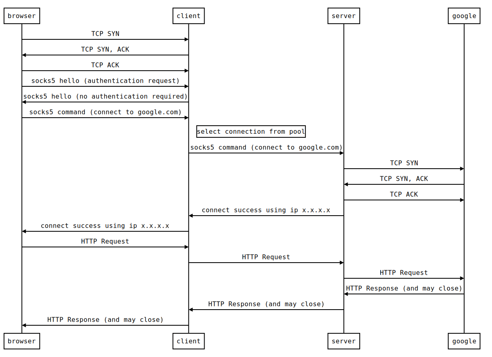

# GoTunnel

A simple and naive ladder written in less than 300 lines of go code.

# How it works

# Todo

1. connection pool support
2. security enhancement

# WTFPL 

Do What The Fuck You Want To Public License

